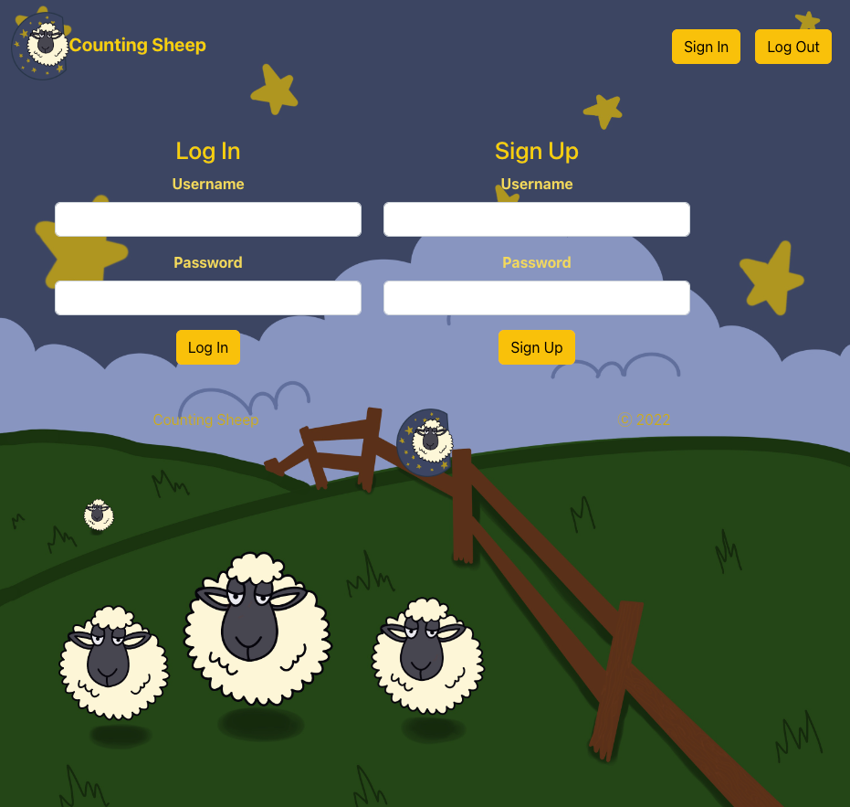
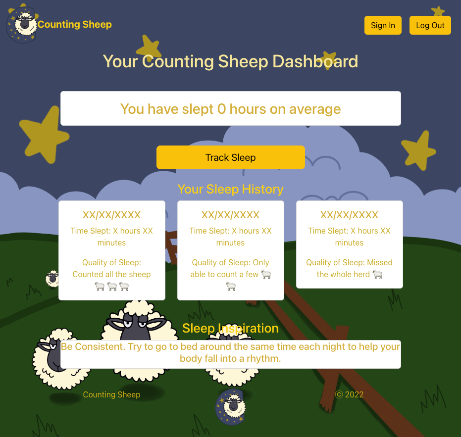
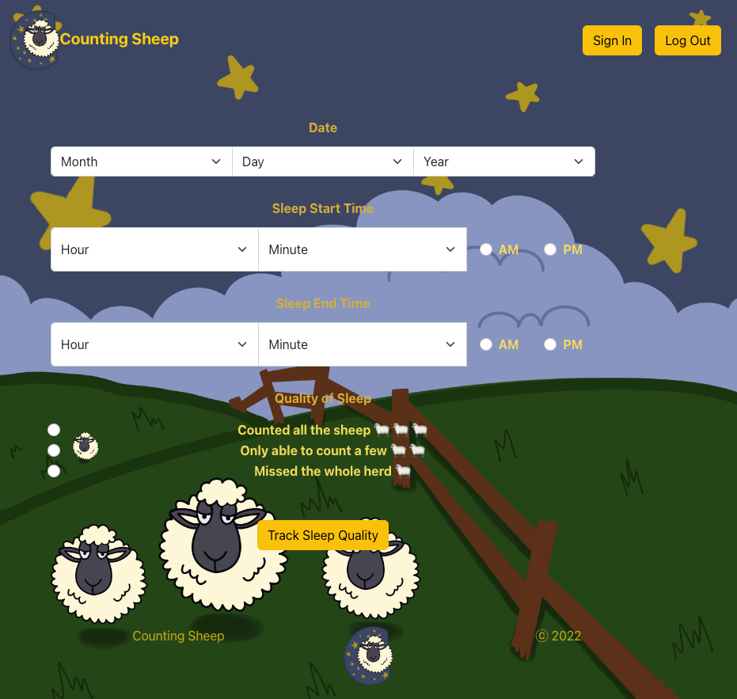

# Counting Sheep 🐑

# Description
This is a full stack React application that a user may create an account, login, track sleep history, receive randomized sleep inspiration. 

# Acceptance Criteria
We wrote the  code to meet the following acceptance criteria:

* Use React for the front end.
* Use GraphQL with a Node.js and Express.js server.
* Use MongoDB and the Mongoose ODM for the database.
* Use queries and mutations for retrieving, adding, updating, and deleting data.
* Be deployed using Heroku (with data).
* Have a polished UI.
* Be responsive.
* Be interactive (i.e., accept and respond to user input).
* Include authentication (JWT).
* Protect sensitive API key information on the server.
* Have a clean repository that meets quality coding standards (file structure, naming conventions, best practices for class and id naming conventions, indentation, high-quality comments, and so on).
* Have a high-quality README (with unique name, description, technologies used, screenshot, and link to deployed application).

# Installation

* npm install to install required npm packages
* npm start to initialize application

# Usage
To use this application, first create an account or log in. Then begin tracking your sleep time and quality using the sleep tracker form. You can view your history and sleep inspiration on your customized dashboard.

# Capabilities

* Create an account or login
* Track your sleep date, start & end times as well as your quality of sleep.
* View your sleep history on the dashboard
* Receive randomized sleep advice and inspiration

# Deployed Heroku application: 

Please see [live page here](https://radiant-chamber-76949.herokuapp.com/)

# Contributors
* [Tyler Morse](https://github.com/tmorse2222)
* [Jayita Chowdhury](https://github.com/jayita87)
* [Jean Bissai](https://github.com/JeanBissai)
* [Matt Goldhammer](https://github.com/MattG-Git)

# Screenshot

